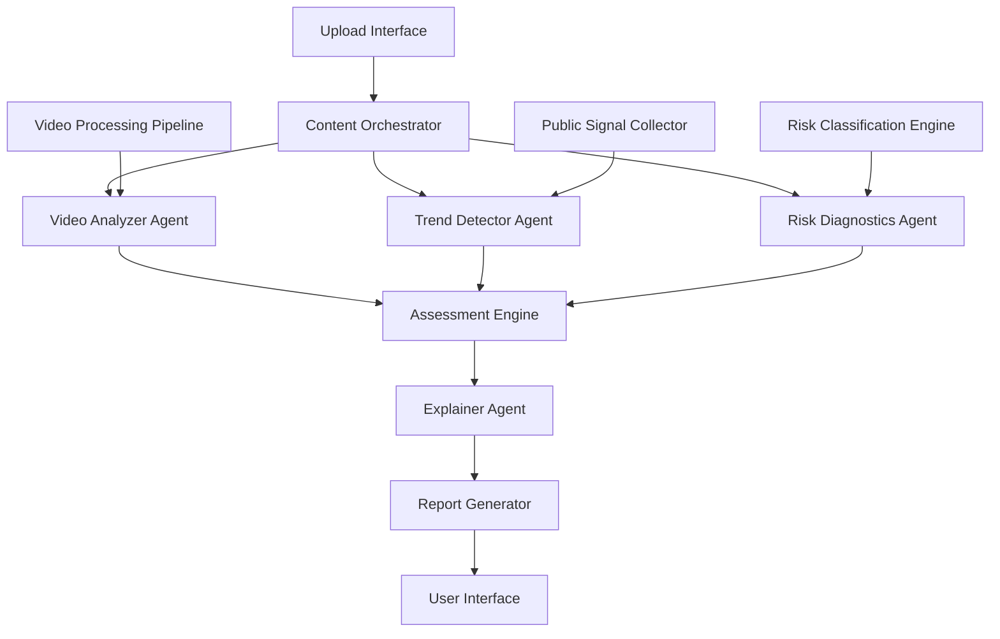

# Design Document: ProjectTrendPilot AI

## Overview

ProjectTrendPilot AI is a pre-upload content evaluation platform that provides Instagram creators with data-driven insights before publishing. The system employs a multi-agent architecture to analyze video content through three primary evaluation dimensions: trend freshness detection, structural video analysis, and risk assessment. The platform processes user-uploaded draft videos and generates comprehensive readiness reports within 10 seconds, enabling creators to make informed publishing decisions.

The system's core innovation lies in shifting from retrospective analytics to predictive assessment, using only publicly observable signals to maintain compliance and accessibility. The architecture emphasizes explainability, ensuring every assessment component can be traced back to observable evidence.

## Architecture

The system follows a microservices architecture with specialized agents handling distinct evaluation aspects:



### Core Components

**Content Orchestrator**: Central coordination service that manages the evaluation workflow, handles file uploads, and coordinates between specialized agents.

**Video Analyzer Agent**: Processes video files to extract structural metrics including duration, pacing, visual transitions, audio patterns, and engagement indicators.

**Trend Detector Agent**: Monitors publicly observable platform signals to identify relevant trends and classify their freshness stages (emerging, peak, declining, saturated).

**Risk Diagnostics Agent**: Evaluates potential publishing risks across four categories: timing, saturation, format mismatch, and scroll-past risk.

**Assessment Engine**: Synthesizes inputs from all agents to generate the final content readiness score and confidence levels.

**Explainer Agent**: Generates human-readable reasoning for all assessment components, ensuring transparency and educational value.

## Components and Interfaces

### Upload Interface
- **Purpose**: Handles video file uploads and initial validation
- **Input**: Video files (MP4, MOV, AVI) up to 500MB
- **Output**: Upload confirmation and processing initiation
- **Interface**: RESTful API with multipart form data support

### Video Analyzer Agent
- **Purpose**: Extracts and analyzes structural video elements
- **Key Functions**:
  - Duration and pacing analysis
  - Visual transition detection
  - Audio pattern recognition
  - Opening sequence evaluation for scroll-past risk
- **Output**: Structural metrics object with confidence scores

### Trend Detector Agent
- **Purpose**: Identifies and classifies trend freshness using public signals
- **Data Sources**: 
  - Hashtag frequency analysis
  - Content pattern recognition
  - Temporal trend tracking
- **Output**: Trend classification with confidence levels and supporting evidence

### Risk Diagnostics Agent
- **Purpose**: Categorizes and prioritizes potential publishing risks
- **Risk Categories**:
  - **Timing Risk**: Trend lifecycle misalignment
  - **Saturation Risk**: Overcrowded trend participation
  - **Format Mismatch**: Structural incompatibility with platform norms
  - **Scroll-Past Risk**: Poor opening sequence engagement potential
- **Output**: Prioritized risk assessment with severity levels

### Assessment Engine
- **Purpose**: Synthesizes agent outputs into final readiness score
- **Scoring Algorithm**:
  - Trend freshness weight: 30%
  - Structural quality weight: 40%
  - Risk factor weight: 30%
- **Output**: Content readiness score (0-100) with confidence level

### Explainer Agent
- **Purpose**: Generates transparent reasoning for all assessments
- **Functions**:
  - Evidence citation for trend classifications
  - Structural issue explanation
  - Risk factor justification
  - Confidence level reasoning
- **Output**: Human-readable explanation with supporting evidence

## Data Models

### Video Content Model
```typescript
interface VideoContent {
  id: string;
  filename: string;
  duration: number;
  fileSize: number;
  format: VideoFormat;
  uploadTimestamp: Date;
  processingStatus: ProcessingStatus;
}

enum VideoFormat {
  MP4 = "mp4",
  MOV = "mov", 
  AVI = "avi"
}

enum ProcessingStatus {
  UPLOADED = "uploaded",
  PROCESSING = "processing",
  COMPLETED = "completed",
  FAILED = "failed"
}
```

### Structural Analysis Model
```typescript
interface StructuralAnalysis {
  videoId: string;
  duration: number;
  averagePacing: number;
  transitionCount: number;
  audioQuality: AudioQualityMetrics;
  openingSequence: OpeningSequenceAnalysis;
  confidence: number;
}

interface AudioQualityMetrics {
  hasAudio: boolean;
  volumeConsistency: number;
  backgroundMusicPresent: boolean;
}

interface OpeningSequenceAnalysis {
  hookStrength: number;
  visualImpact: number;
  scrollPastRisk: RiskLevel;
}
```

### Trend Analysis Model
```typescript
interface TrendAnalysis {
  videoId: string;
  identifiedTrends: Trend[];
  overallTrendScore: number;
  confidence: number;
  lastUpdated: Date;
}

interface Trend {
  name: string;
  category: string;
  freshnessStage: TrendFreshness;
  confidence: number;
  supportingEvidence: string[];
}

enum TrendFreshness {
  EMERGING = "emerging",
  PEAK = "peak", 
  DECLINING = "declining",
  SATURATED = "saturated"
}
```

### Risk Assessment Model
```typescript
interface RiskAssessment {
  videoId: string;
  risks: Risk[];
  overallRiskLevel: RiskLevel;
  confidence: number;
}

interface Risk {
  category: RiskCategory;
  severity: RiskLevel;
  description: string;
  evidence: string[];
  mitigation?: string;
}

enum RiskCategory {
  TIMING = "timing",
  SATURATION = "saturation", 
  FORMAT_MISMATCH = "format_mismatch",
  SCROLL_PAST = "scroll_past"
}

enum RiskLevel {
  LOW = "low",
  MEDIUM = "medium",
  HIGH = "high"
}
```

### Assessment Report Model
```typescript
interface AssessmentReport {
  videoId: string;
  readinessScore: number;
  confidence: number;
  structuralAnalysis: StructuralAnalysis;
  trendAnalysis: TrendAnalysis;
  riskAssessment: RiskAssessment;
  explanation: ExplanationReport;
  timestamp: Date;
  processingTime: number;
}

interface ExplanationReport {
  scoreReasoning: string;
  trendExplanation: string;
  structuralExplanation: string;
  riskExplanation: string;
  recommendations?: string[];
}
```